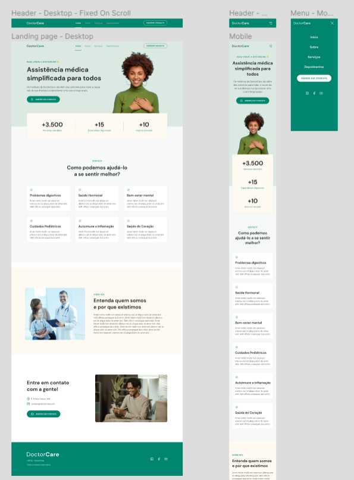

# frontend-doctorcare
<h2>Challenge frontend design for Project Doctorcare</h2>

<h2>Responsive SPA Page</h2>

<strong>Project:</strong> Convert mobile and desktop layouts from Figma. Using:

<ul>
  <li>HTML</li>
  <li>CSS</li>
  <li>Sass SCSS</li>
  <li>Javascript</li>
  <li>Dynamic HSL Colors</li>
  <li>Media Queries</li>
  <li>Flexbox</li>
  <li>Grid</li>
  <li>Modal Mobile Menu</li>
</ul>

The color pallete has been made as dynamic, to easilly change the primary color in just one line of code. This also applies to the SVG colors which follows the pallete along with the rest of page content.

The Figma layout had two different content layouts for mobile and desktop in various sections of the page, so it required a css more tailored for each case and viewport sizes.

I constructed the header menu with 4 different states and designs asked from Figma, which are non-stick for mobile and desktop, and sticky for mobile and desktop.

The site frontend project has been constructed as a single page, switching from menu links via dynamic Javascript. Also when page scrolls, Javascript will switch the sticky menu states between non-sticky and sticky, both for mobile and desktop viewport sizes.

While on mobile viewport size, the menu becomes 'modal', filling the page with just the mobile menu.

Added some tab indexes for easy navigation to the important links and added some aria labels for accessibility.

<strong>Notes:</strong>I could have used only CSS for header and mobile states and interactivity, but I decided to do it with Javascript, to push the limits a little bit.

<h2>Example Images</h2>

Figma Reference 

Mobile Navigation 

Tablet Navigation 

Desktop Navigation 

